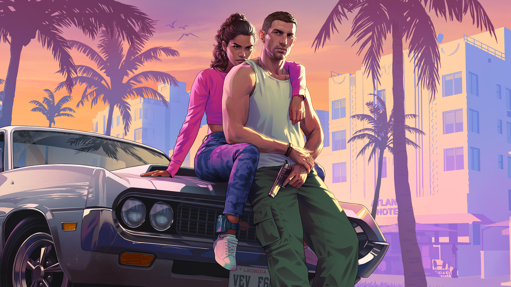
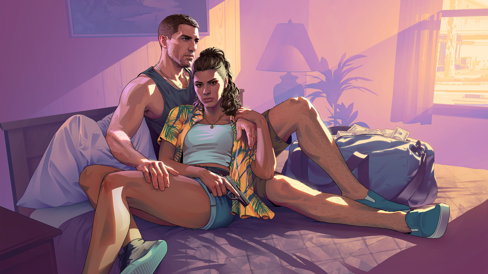
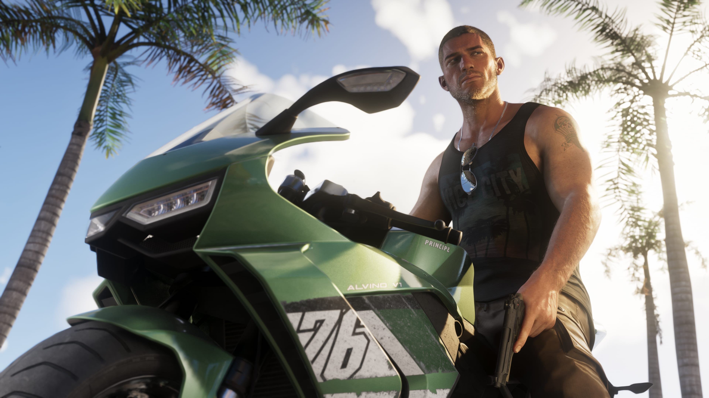
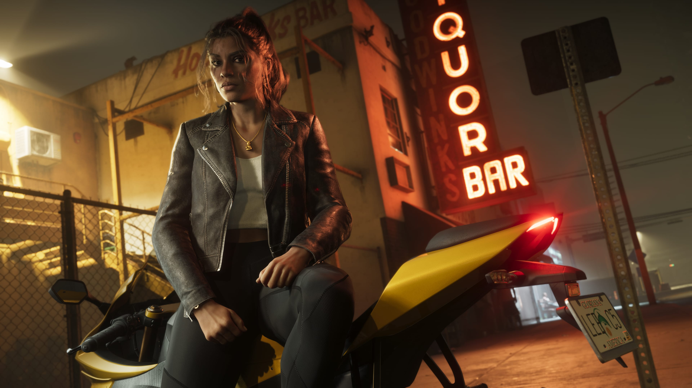

# 🎮 GTA-VI-Interactive-Fan-Concept

> **An immersive fan-made cinematic web experience inspired by Grand Theft Auto VI.**

Step into a digital recreation of the excitement surrounding GTA VI. This project is not just a website—it's a cinematic journey designed to capture the energy, atmosphere, and anticipation of one of the most awaited games in entertainment history.

Built with modern web technologies, advanced animations, and interactive storytelling, GTA-VI-Interactive-Fan-Concept aims to deliver an experience that feels closer to an official game showcase than a traditional website.

---

## 🌴 The Vision

For years, Rockstar Games has set the benchmark for open-world experiences. GTA VI represents the next evolution of that legacy.

This project was created with a simple question:

**"What if fans could experience the hype of GTA VI through an interactive, next-generation website?"**

Rather than displaying static information, this project focuses on immersion.

Every section is designed to make visitors feel like they are entering the world of Leonida and Vice City through cinematic visuals, smooth transitions, dynamic interactions, and carefully crafted storytelling.

The goal is to combine:

* Modern web development
* Interactive storytelling
* Cinematic presentation
* Gaming-inspired UI/UX
* High-performance frontend engineering

into a single immersive experience.

---

# 🌆 Experience Overview

The website transforms traditional scrolling into an interactive journey.

Visitors move through multiple themed sections, each revealing a different aspect of the GTA VI universe.

Instead of reading information, users **discover** it.

---

## 🎬 Hero Experience

The journey begins with a cinematic fullscreen landing experience.

### Features

* Dynamic background visuals
* High-impact typography
* Smooth entrance animations
* Interactive call-to-actions
* Parallax effects
* Scroll-driven storytelling
* Immersive atmosphere inspired by Vice City

The objective is simple:

> Make visitors feel excited within the first few seconds.

---

## 🌴 Vice City Atmosphere

Vice City has always been one of the most iconic locations in gaming history.

This section focuses on recreating the city's modern identity through:

* Neon-inspired visual design
* Tropical aesthetics
* Animated city elements
* Dynamic lighting effects
* Interactive exploration sections

Every design choice is intended to evoke the feeling of a living, vibrant coastal metropolis.

---

## 🧑‍🤝‍🧑 Character Showcase

One of the strongest aspects of GTA VI is its protagonists and supporting cast.

The Character Showcase introduces visitors to the major personalities shaping the story.

### Planned Features

* Interactive character cards
* Animated reveal sequences
* Character biographies
* Relationship mapping
* Hover interactions
* Dynamic transitions

Each character section is designed to feel like an official Rockstar promotional reveal.

---

## 🗺️ World Exploration

Grand Theft Auto has always been about freedom.

The World Exploration section provides visitors with an overview of the game's environment and scale.

### Features

* Interactive world presentation
* Region highlights
* Points of interest
* Animated map sections
* Exploration-focused storytelling

The objective is to communicate the massive scale and diversity of the GTA VI world.

---

## 🚗 Vehicles & Lifestyle

Cars, speed, and luxury have always been part of GTA culture.

This section celebrates the lifestyle side of GTA VI.

### Planned Content

* Vehicle showcases
* Performance categories
* Visual galleries
* Animated displays
* Interactive transitions

Presented in a way that feels premium and cinematic.

---

## 💰 Crime, Chaos & Opportunity

The GTA franchise revolves around ambition, crime, and power.

This section explores:

* Criminal enterprises
* Story themes
* Economic systems
* Risk versus reward
* Rise-to-power narratives

Through immersive visuals and storytelling elements.

---

## 🎮 Interactive Features

The website is designed to be more than a visual showcase.

### Current & Planned Interactions

* Smooth scrolling
* Animated page transitions
* Hover-triggered effects
* Interactive navigation
* Dynamic content reveals
* Scroll-based storytelling
* Motion-driven UI elements
* Responsive animations
* Mouse movement interactions
* Cinematic loading sequences

---

# 📸 Project Showcase

---

# ⚡ Technical Architecture

The project is built using a modern frontend stack optimized for both performance and visual fidelity.

## Frontend

* React.js
* Vite
* JavaScript / TypeScript
* Tailwind CSS

## Animation & Motion

* Framer Motion
* GSAP
* CSS Keyframe Animations

## UI Design

* Custom Components
* Responsive Layout System
* Mobile-First Development
* Modern Design Principles

## Deployment

* Vercel
* Netlify
* GitHub Pages

---

# 🚀 Performance Goals

A visually impressive website should still feel fast.

Key objectives include:

* Fast loading speeds
* Responsive interactions
* Optimized asset delivery
* Smooth animations
* High Lighthouse scores
* Mobile optimization
* Accessibility improvements

---

# 📅 Development Roadmap

## Phase 1 — Foundation

* [x] Project setup
* [x] Design system creation
* [x] Home page development
* [x] Core UI implementation

## Phase 2 — Interactive Experience

* [ ] Character showcase
* [ ] Story sections
* [ ] World exploration
* [ ] Vehicle showcase
* [ ] Advanced animations

## Phase 3 — Polish

* [ ] Performance optimization
* [ ] Accessibility review
* [ ] Mobile refinement
* [ ] Final visual improvements

## Phase 4 — Launch

* [ ] Production deployment
* [ ] Public release
* [ ] Community feedback
* [ ] Future updates

---

# 🎯 Project Objectives

This project serves multiple purposes:

### Fan Tribute

A celebration of the excitement surrounding GTA VI.

### Portfolio Project

A demonstration of advanced frontend development skills.

### Technical Experiment

Exploring modern animation systems and interactive storytelling.

### Learning Platform

Pushing the boundaries of what can be achieved with React and modern web technologies.

---

# ⚠️ Disclaimer

This is an **unofficial fan-made project**.

Grand Theft Auto, GTA, GTA VI, Vice City, Rockstar Games, and all related intellectual property belong to Rockstar Games and Take-Two Interactive.

This project is created solely for:

* Educational purposes
* Portfolio demonstration
* Frontend development practice
* Fan appreciation

No commercial use is intended.

---

# 🌟 Future Ideas

Potential future additions include:

* Dynamic weather system
* Day/Night cycle
* Interactive Vice City map
* GTA-style radio player
* Character relationship network
* Mission timeline system
* Easter eggs and hidden content
* Community gallery
* Achievement system
* Interactive game statistics

---

# 👨‍💻 Developer

**Jaymeen Vaghela**

Computer Engineering Student • Frontend Developer • Gaming Enthusiast

Passionate about creating immersive digital experiences that blend storytelling, design, and technology.

---

## 🌴 Welcome to Vice City.

### The sun is rising. The streets are alive. The story is just beginning.

### November is coming.

### See you in Leonida.
